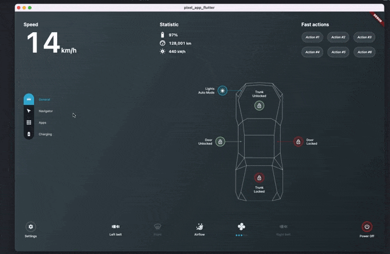
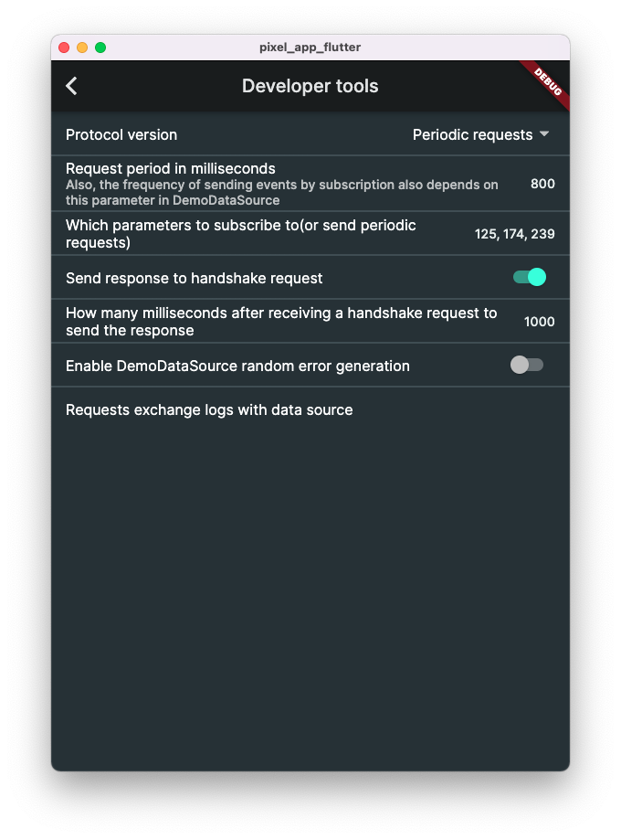
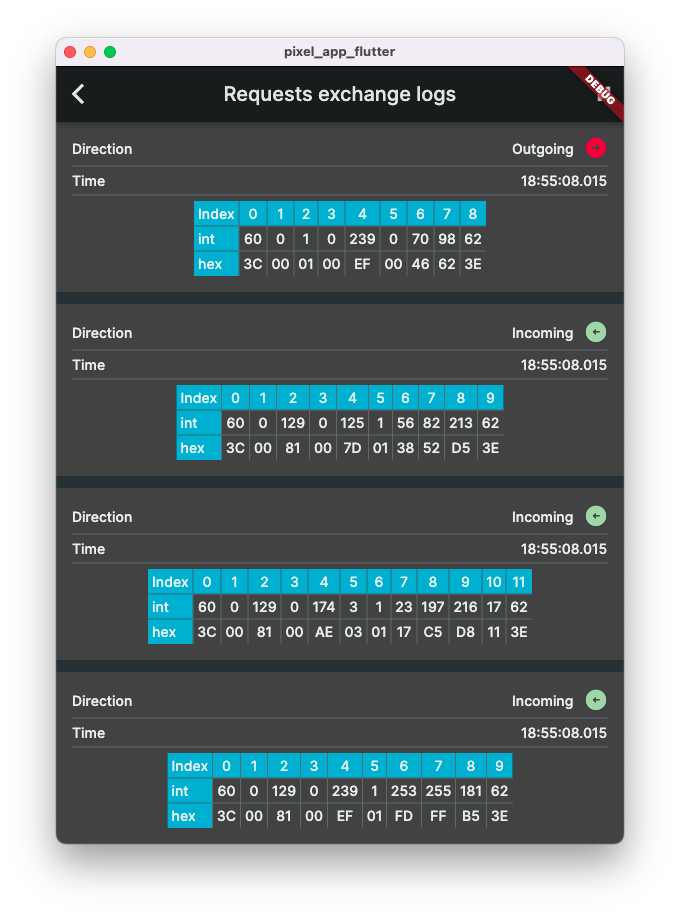

# Pixel App Flutter

![coverage][coverage_badge]
[![style: very good analysis][very_good_analysis_badge]][very_good_analysis_link]
[![License: MIT][license_badge]][license_link]


## Navigation

- [About](#about)
- [What is currently implemented](#what-is-currently-implemented)
- [What should be implemented](#what-should-be-implemented)
- [How can i contribute?](#how-can-i-contribute)
- [How to lauch the project](#how-to-lauch-the-project)
- [Running Tests](#running-tests)

## <a name="about">About</a>
---
This project is an application written using Dart and Flutter for an ambitious open source project called [StarPixel](https://wiki.starpixel.org/books/informaciya-dlya-novickov/page/obshhee-polozenie).

StarPixel is conceived as an electric car that absolutely anyone can build, using opensource information like drawings and software.

The main purpose of this application is to manage the functions of the car. it is also considered to be used as an on-board computer.

For now, while the IT team of this project is in search of the connection protocol realization in the best way, the app connects to the hardware through bluetooth. In the future we plan to implement connection through USB, WIFI and HTTP, so that user can choose the interface connection, which suits him best.

As the main hardware was choosen esp32. The software for esp32(called MainECU) [lives here](https://github.com/starfactorypixel/MainECU).
The MainECU is the connecting link between this application and car interfaces.

[Click here to open the design project in figma](https://www.figma.com/file/8A4BWY3FPJMMPZXdEnLtGt/StarPixel?node-id=286%3A493).


## <a name="what-is-implemented">What is currently implemented</a>
---
* __Bluetooth Data Source(currently only on android)__
  
  *For now, bluetooth connection with an esp32 device works only on android, because we use esp32 devices with Bluetooth Classic(under v4.0). Apple does not allow to use Bluetooth Classic if the device is not registered with the [MFI Program](https://mfi.apple.com/). There is also esp32 devices with BLE(bluetooth version >=4.0), so if we will decide to replace Bluetooth Classic esp32 devices with Low Energy ones, we will have the oportunity to implement bluetooth connection also on iOS*

* __Demo Data Source__

  *The purpose is to connect to a mocked service like to a real one. It generates random values(like speed and voltage). This way you can work on UI, for example, without the need to connect to a real device(maybe you din't have it at all).*

* __Responsive UI__
  
  

* __Localization__
  
  *Currently english and russian.*

* __Flavors(generated by the [Very Good CLI][very_good_cli_link])__
  
  *Development, staging and production.*

* __Developer Tools__
  
  *A set of parameters and settings, which are useful in the process of development. Developer tools are available only on development flavor*

  
  

* __Firebase__
  
  *Analytics and Crashlytics*

* __Launcher(for android)__
  
  *On android there is an option to choose the application as the default laucher. That way you can have an android device specially to use it as on-board computer*


## <a name="what-should-be-implemented">What should be implemented</a>
---


* __Other connection options__
  
  *Via USB, WIFI, and HTTP*

* __Bluetooth connection on iOS__
  
  *The reason why it's not implemented for now is in the [What is currently implemented](#what-is-currently-implemented) section*

## <a name="how-can-i-contribute">How can i contribute?</a>
---
If you want to work constantly on this project please [read the general regulations](https://wiki.starpixel.org/books/informaciya-dlya-novickov/page/obshhee-polozenie). Also there you will find instructions on how to join the team. Here is [the StarPixel discord server](https://discord.gg/ZfhKuAX4).

## <a name="how-to-launch-the-project">How to lauch the project</a>
---
This project currently runs on __Android__, __iOS__, and __MacOS__. For other platforms it may require some setup. Therefore, below will be instructions on how to lauch this project on these platforms.

Of course, you should have installed Dart and Flutter. If you haven't done this yet, please take a look at the [documentation](https://github.com/radomir9720/wordle_4letter#:~:text=online%20documentation).

To launch the project you also should paste required firebase related files(`google-services.json` for android, and `GoogleService-Info.plist` with `firebase_app_id_file.json` for iOS and MacOS).

If you want to contribute and work constantly on this project, you can contact me, i will give you access to the firebase project. Otherwise you can just create your own firebase project and download firebase related files. Also note that this project contains 3 flavors, and for each flavor was created an app on firebase. For android there is no big difference, because configurations for all these projects are inside one file, while for iOS you should have three different files `GoogleService-Info.plist` and also three different files `firebase_app_id_file.json`(one for each flavor). MacOS does not support flavors, therefore for MacOS you need only one file `GoogleService-Info.plist` and one file `firebase_app_id_file.json`.

__For android__ you need to put the `google-services.json` file in the `android/app` directory, so the full path should be `android/app/google-services.json`.

__For iOS__ you should prepare three different files `GoogleService-Info.plist` and three different files `firebase_app_id_file.json`(one for each flavor: for production, staging, and development). Then you need to put these files respectively in directories `ios/config/development/`, `ios/config/staging/`, and `ios/config/production/`. So in the end you should have the following structure:
```
ios/
    config/
        development/
            firebase_app_id_file.json
            GoogleService-Info.plist
        staging/
            firebase_app_id_file.json
            GoogleService-Info.plist
        production/
            firebase_app_id_file.json
            GoogleService-Info.plist
```
__For iOS__ you need to put the `GoogleService-Info.plist` file in the `macos/Runner/` directory, so the full path should be `macos/Runner/GoogleService-Info.plist` and the `firebase_app_id_file.json` file in the `macos/` directory, so the full path should be `macos/firebase_app_id_file.json`.

This project contains 3 flavors:

- development
- staging
- production

To run the desired flavor either use the launch configuration in VSCode/Android Studio or use the following commands:

```sh
# Development
$ flutter run --flavor development --target lib/main_development.dart

# Staging
$ flutter run --flavor staging --target lib/main_staging.dart

# Production
$ flutter run --flavor production --target lib/main_production.dart
```

Again, if you want to lauch the app on __MacOS__, the commands above won't work, because __MacOS__ does not support flavors. If you are using VSCode you can use lauch configurations with the `[No flavor]` suffix. Or, if you want to use commands, you can use the commands above, just remove the flavor option(for example: `flutter run --target lib/main_development.dart`)


---

## <a name="running-tests">Running Tests 🧪</a>

To run all unit and widget tests use the following command:

```sh
$ flutter test --coverage --test-randomize-ordering-seed random
```

To view the generated coverage report you can use [lcov](https://github.com/linux-test-project/lcov).

```sh
# Generate Coverage Report
$ genhtml coverage/lcov.info -o coverage/

# Open Coverage Report
$ open coverage/index.html
```

[coverage_badge]: coverage_badge.svg
[flutter_localizations_link]: https://api.flutter.dev/flutter/flutter_localizations/flutter_localizations-library.html
[internationalization_link]: https://flutter.dev/docs/development/accessibility-and-localization/internationalization
[license_badge]: https://img.shields.io/badge/license-MIT-blue.svg
[license_link]: https://opensource.org/licenses/MIT
[very_good_analysis_badge]: https://img.shields.io/badge/style-very_good_analysis-B22C89.svg
[very_good_analysis_link]: https://pub.dev/packages/very_good_analysis
[very_good_cli_link]: https://github.com/VeryGoodOpenSource/very_good_cli
